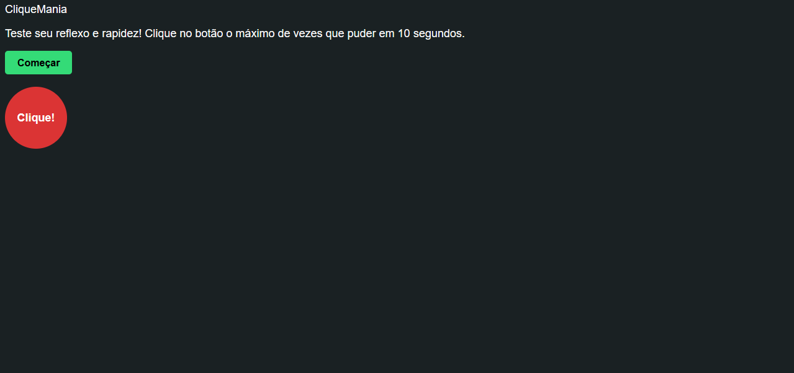

# Jogo do Clique

Mini game feito em HTML, CSS e JavaScript para treinar manipulação de DOM.
O objetivo é clicar no alvo que se move pela tela e fazer o máximo de pontos antes do tempo acabar.

## 🎮 Demonstração

## 🚀 Tecnologias
- HTML
- CSS
- JavaScript (DOM + eventos)

## 📦 Como usar
1. Baixe ou clone este repositório.
2. Abra o arquivo `index.html` no navegador.
3. Clique no alvo o mais rápido possível!

## 📁 Estrutura
├── index.html
├── style.css
├── script.js

## 📜 Licença
Uso livre para estudos.
